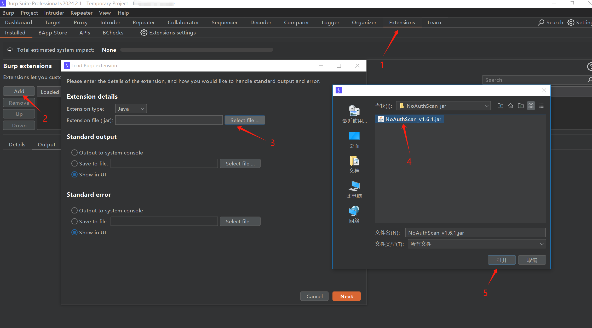
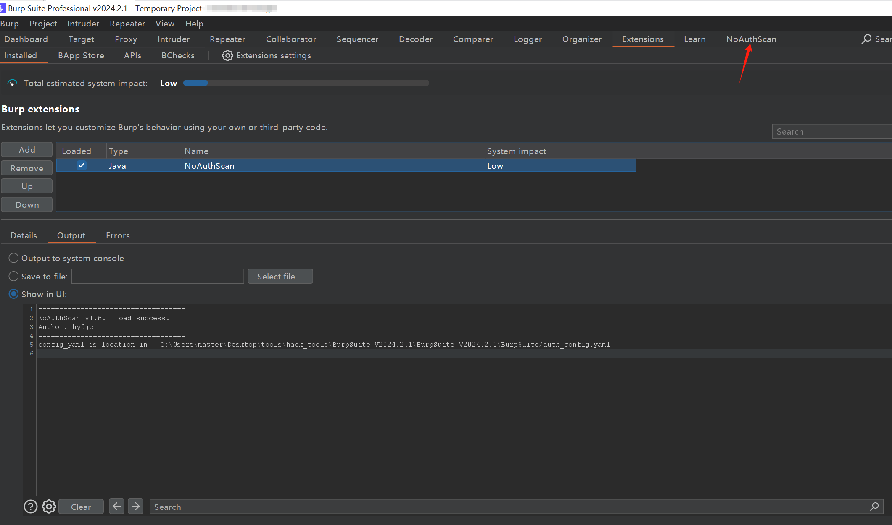
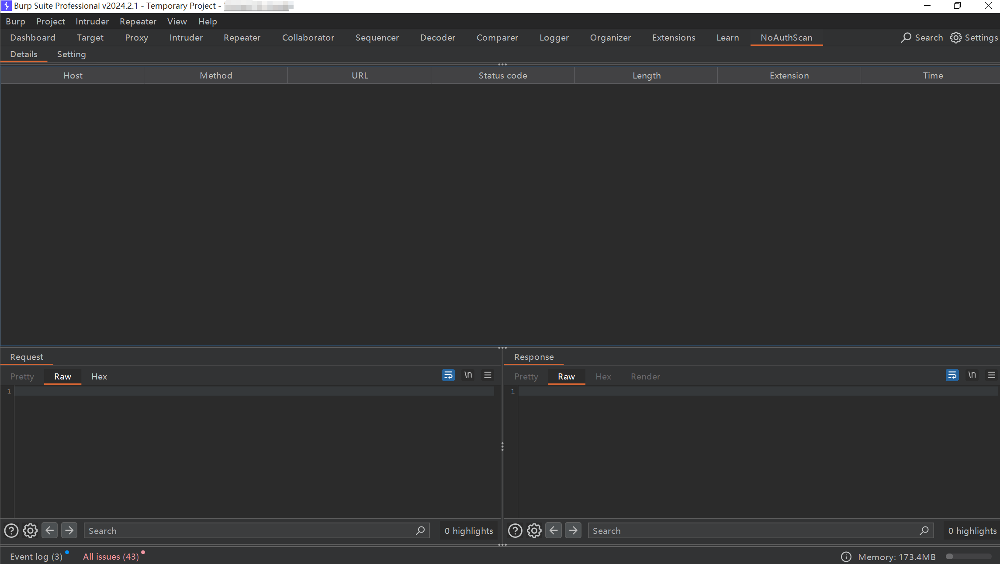
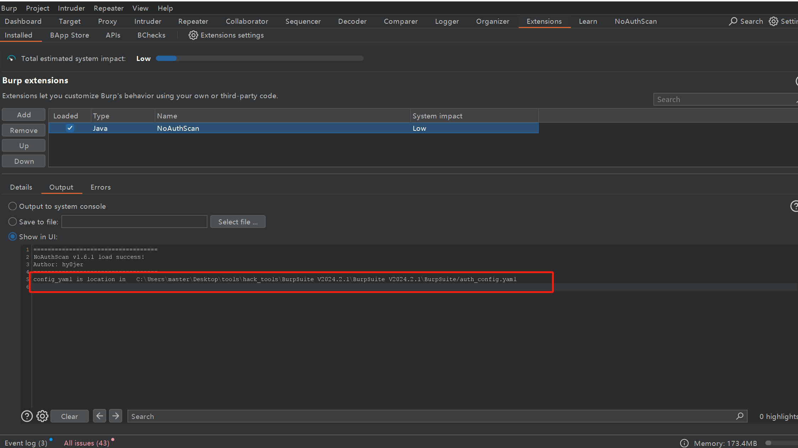
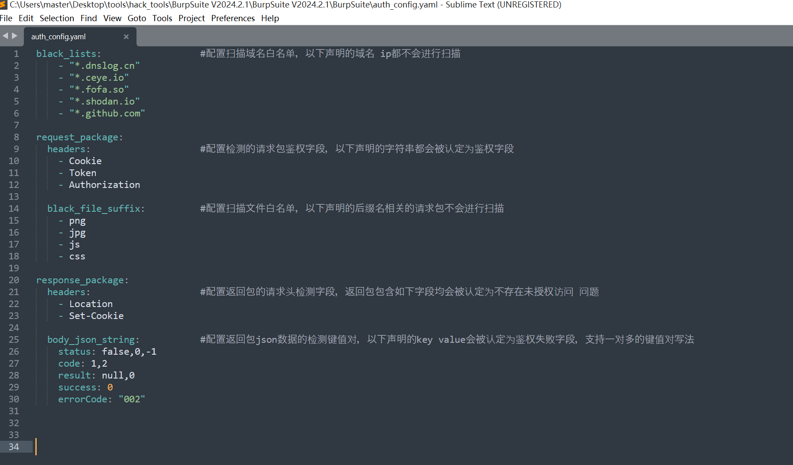
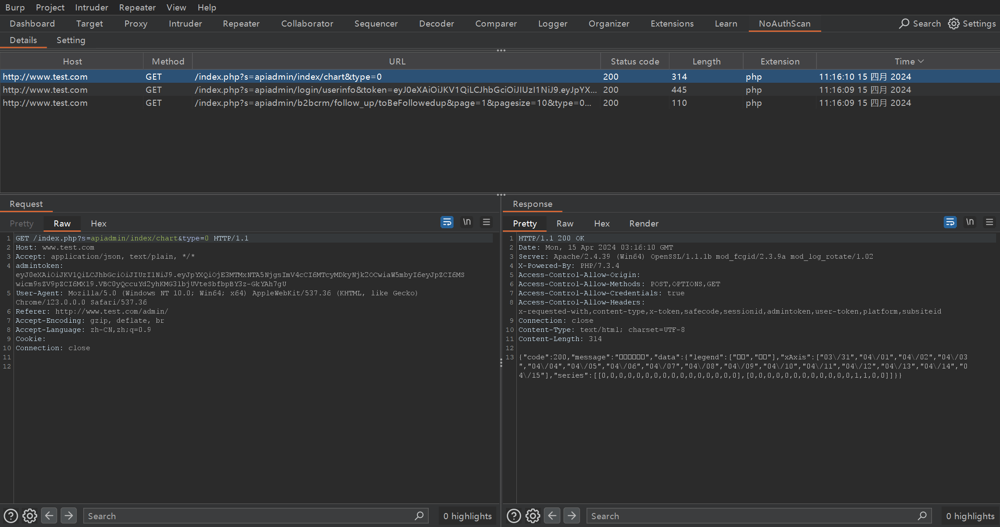
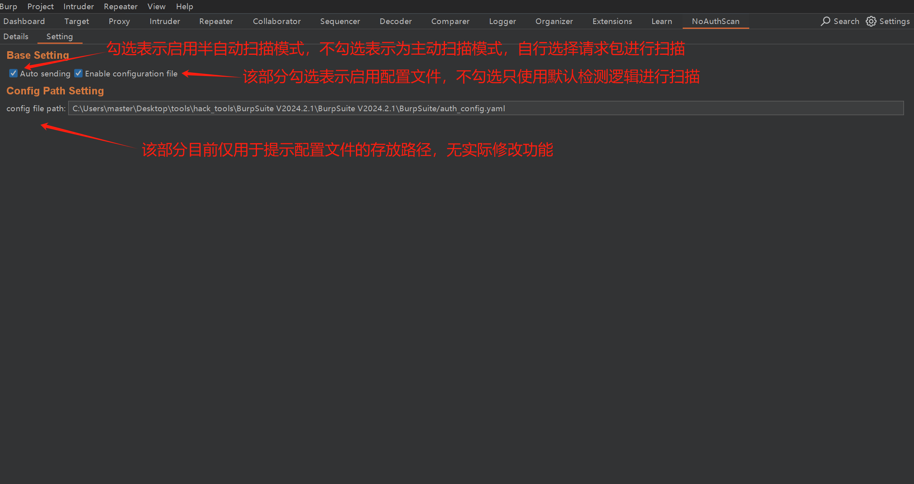

# NoAuthScan

NoAuthScan 是基于Burp Suite提供的MontoyaApi开发的插件，可用于检测应用程序可能存在的未授权访问问题

## 安装说明

### **运行环境建议**

```
JDK  >= 17.0.4

burpsuite version >= 2023.12.1
```

### 安装步骤概述

在burp suite的Extensions选项页面添加NoAuthScan 插件，具体步骤如下图所示



正常安装完成后，是如下图所示





## 配置文件说明

### auth_config.yaml 介绍

#### 概述

auth_config.yaml是NoAuthScan插件扫描时使用到的配置文件，该文件中的配置项可改变插件检测引擎的扫描逻辑，使其适应不同场景的扫描需求。因此在每次检测开始前，应根据实际情况改写配置文件中的配置项，提高检测准确率。

目前已实现自定义检测配置项

- 支持自定义检测请求包，返回包中请求头字段分析
- 支持自定义设置请求包鉴权字段设置
- 支持设置扫描域名白名单
- 支持设置过滤不检测 指定后缀名文件，例如设置不扫描.jpg .css文件
- 支持自定义json数据分析，在返回包为json数据时，根据指定字段分析是否存在未授权问题

#### 配置文件存放路径

在初次加载NoAuthScan插件时，会提示配置文件的存放路径，根据提示信息存放配置文件即可



配置文件样例如下，该文件可在插件github仓库主页获取



## 插件使用说明

该插件基于配置文件进行漏洞扫描，初次使用应设置 配置文件

目前支持两种扫描模式，半自动扫描以及主动扫描，默认启用半自动扫描模式

### 半自动扫描

该模式下，经过burp suite，并且符合条件的请求包都会进行未授权检测分析，符合未授权访问漏洞特征的请求响应包会在插件的详情页排列显示,示例如下



### 主动扫描

~~该模式下，可指定选择burp suite中记录的请求包进行未授权检测~~

#新版本burpsuite 下该模式未生效，暂时处于无效状态，后续待完善


两种模式切换通过本插件的setting页面设置，如下图所示，各部分作用已在下图标注



## 免责声明

    该插件是作为一个开源项目提供的，仅用于教育和合法的安全测试目的。使用本插件的个人或实体应确保其行为符合当地法律和规定。开发者不对任何非法使用本插件的行为负责，也不对因使用或滥用本插件而导致的任何形式的直接或间接损失、损害或后果承担责任。
使用本插件意味着您同意不将其用于任何非法目的，包括但不限于未经授权的入侵、破坏网络安全、侵犯隐私权或任何其他可能违反任何法律、法规或道德标准的行为。如果您选择使用本插件，您必须自行承担使用本插件可能带来的风险。


